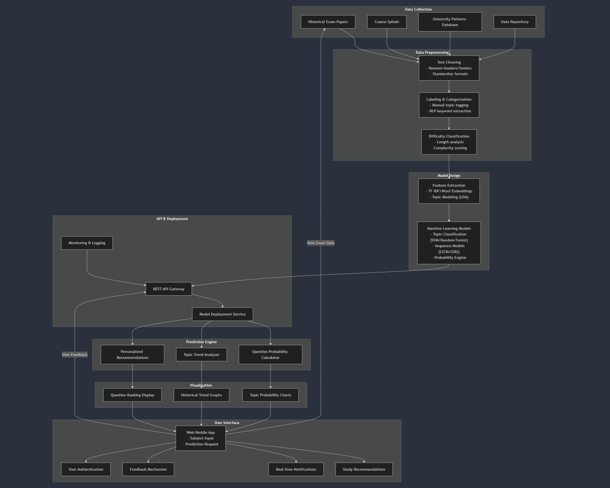

# Exam Predictor: AI-Based Question Prediction System 💻🔍

Exam Predictor is an intelligent study companion designed specifically for Computer Science and Engineering (CSE) students. By leveraging state-of-the-art AI/ML and NLP techniques, this tool analyzes historical exam papers, syllabus details, and evolving exam trends to forecast high-probability questions and key topics. Whether you're in a crunch or planning your revision strategy, Exam Predictor ensures that your study sessions are laser-focused on areas that matter most.

---

## Project Overview

The **AI-Powered Exam Question Prediction System** is engineered to empower CSE students by predicting exam questions based on a comprehensive analysis of past papers and syllabus content. By identifying patterns in question types, topics, and difficulty levels, the system not only predicts probable exam questions but also recommends tailored study materials. This strategic insight is intended to complement in-depth learning, enabling smarter, more efficient revision.

---

## Key Features

### 1. Accurate Exam Question Prediction
- **Historical Analysis:** Scrutinizes years of exam papers to extract recurring patterns and trends.
- **Probability Forecasting:** Uses statistical and machine learning models to assign likelihood scores to predicted topics and questions.
- **Adaptive Learning:** Continuously refines predictions as new exam papers and syllabus changes become available.
-  **Question Format Classification:** Focuses on generating short and long questions to better align with in-depth assessment strategies.

### 2. Customized Study Recommendations
- **Targeted Content:** Provides focused study resources and materials aligned with high-probability topics.
- **Learning Path Optimization:** Suggests a prioritized revision roadmap based on individual strengths and weaknesses.

### 3. Comprehensive Historical Exam Paper Analysis
- **Data Upload:** Users can upload past exam papers for in-depth analysis.
- **Trend Visualization:** Interactive dashboards display topic frequency and difficulty trends over multiple years.
- **Detailed Metrics:** Insights into question formats, complexity, and subject-wise distributions help refine study plans.

### 4. Real-Time Notifications & Alerts
- **Timely Updates:** Receive alerts on emerging trends and high-probability topics as exam dates approach.
- **Personalized Reminders:** Custom notifications keep you on track with your revision schedule.

---

## Technical Architecture

### Backend
- **Frameworks:** Flask or Django serve as robust web frameworks to build RESTful APIs and manage backend logic.
- **Programming Language:** Python is used for data processing, ML model training, and algorithmic prediction.
- **Database:** Options include SQLite for lightweight deployments or PostgreSQL for scalable, production-grade storage of historical data, syllabus details, and prediction outputs.

### Frontend
- **Modern Frameworks:** React or Vue.js power a dynamic, user-friendly interface.
- **Styling:** Bootstrap or Tailwind CSS ensures a responsive and aesthetically pleasing design across devices.
- **Interactivity:** Real-time data visualization and notifications enhance user engagement.

### Model Deployment
- **Client-Side Integration:** Deploy models using TensorFlow.js or ONNX to run predictions directly in the browser (optional for real-time responsiveness).
- **Server-Side API:** Integrate with Flask/Django to serve ML predictions securely and efficiently.

---

## Project Architecture  

  

The diagram above provides a structured overview of how different components interact, from data collection to model deployment and user interaction.  

For the raw mermaid diagram, refer to the file below:  

[View Mermaid Diagram](docs/project_architecture.mermaid)  

## Methodology

### 1. Data Collection
- **Historical Data:** Compile exam papers from at least the past 5–10 years across core CSE subjects such as Data Structures and Algorithms, Operating Systems, Theory of Computation, Computer Networks, Compiler Design, Machine Learning and Computer Graphics.
- **Syllabus Integration:** Gather comprehensive course syllabi to map exam content with curricular changes.
- **Institutional Trends:** Incorporate university-specific exam patterns to capture localized trends and recurring themes.

### 2. Data Preprocessing
- **Text Cleaning:** Remove extraneous elements (headers, footers, instructions) and normalize text data.
- **Categorization & Labeling:** Employ manual annotation and NLP-based classification to tag questions by subject, topic, and difficulty.
- **Feature Engineering:** Extract key features including keywords, topic distributions, and question formats using techniques like TF-IDF, word embeddings, or Latent Dirichlet Allocation (LDA).

### 3. Machine Learning Model Development
- **Feature Extraction:**  
  - **Topic Extraction:** Utilize NLP to extract dominant topics and subtopics.
  - **Question Format Classification:** Distinguish between multiple-choice, short answer, and long-answer questions.
  - **Keyword Analysis:** Identify subject-specific key terms (e.g., "binary tree," "mutex," "quick-sort").
- **Modeling Techniques:**  
  - **Classification Algorithms:** Implement Naive Bayes, SVM, or Random Forest for topic categorization.
  - **Sequence Models:** Consider LSTM or GRU networks to capture temporal trends in exam patterns.
  - **Predictive Analytics:** Use probabilistic models to calculate the likelihood of each topic’s appearance in upcoming exams.

### 4. Prediction and Visualization
- **Forecasting:** The trained models predict potential exam questions based on historical data and evolving trends.
- **Visualization Tools:**  
  - **Topic Probability Distribution:** Graphically display the likelihood of various topics.
  - **Trend Analysis:** Interactive charts and heatmaps illustrate topic frequency and difficulty over time.
  - **Ranked Recommendations:** Generate prioritized lists of potential questions for focused study sessions.

---

## User Interface & Experience

### Web/Mobile Platform
- **Intuitive Dashboard:** Input exam subjects or course names to instantly receive predicted topics and questions.
- **Data Upload Module:** Seamlessly upload historical exam papers to visualize trends and generate predictions.
- **Interactive Recommendations:** Receive detailed study suggestions with links to supplementary resources.
- **Real-Time Alerts:** Stay informed with push notifications and email alerts on high-probability topics as exams approach.

---

## Evaluation and Optimization

### Model Performance Metrics
- **Accuracy and Precision:** Evaluate predictions using standard metrics like accuracy, precision, recall, and F1-score.
- **Cross-Validation:** Employ cross-validation techniques to ensure robust and generalizable models.
- **User Feedback Loop:** Integrate real-world student feedback to iteratively refine and improve prediction accuracy.
- **Continuous Testing:** Monitor performance in live environments and adapt to dynamic curriculum changes.

---

## Project Timeline (3–6 Months)

| **Phase**                          | **Duration** | **Description**                                                                 |
|------------------------------------|--------------|---------------------------------------------------------------------------------|
| **Phase 1: Data Collection**       | 1 Month      | Compile historical exam papers, syllabi, and relevant academic data.             |
| **Phase 2: Data Preprocessing**    | 1 Month      | Clean, label, and extract key features from the dataset.                        |
| **Phase 3: Model Development**     | 2 Months     | Develop, train, and validate machine learning models for exam prediction.      |
| **Phase 4: Evaluation & Optimization** | 1 Month  | Optimize models, evaluate performance, and integrate user feedback.             |
| **Phase 5: UI/UX Development**     | 1 Month      | Build an interactive web/mobile interface for user engagement.                  |
| **Phase 6: Deployment & Feedback** | 1 Month      | Deploy the system and continuously improve based on real-world user interactions. |

---

## Addressing Challenges

- **Educator Engagement:**  
  - *Challenge:* If students can predict exam questions, educators may worry that the focus shifts from comprehensive learning.  
  - *Solution:* Emphasize that **Exam Predictor** is a supplementary tool providing data-driven insights to guide revision, allowing educators to reinforce broader subject understanding and address knowledge gaps.

- **Student Over-Reliance:**  
  - *Challenge:* Students might over-rely on predicted questions as a shortcut, leading to superficial learning.  
  - *Solution:* Implement a recommendation engine and performance tracking that highlights the importance of core concepts, ensuring that predictions complement a thorough study of the entire syllabus.

- **Model Inaccuracy:**  
  - *Challenge:* Predictions may become inaccurate or outdated due to evolving exam patterns.  
  - *Solution:* Continuously retrain the model with new exam data and incorporate post-exam user feedback to fine-tune predictions.

- **Dynamic Curriculum Changes:**  
  - *Challenge:* Frequent updates to course syllabi can quickly render historical trends obsolete.  
  - *Solution:* Monitor curriculum updates, enable customizable syllabus uploads, and schedule regular model retraining to adapt to new topics.

- **Overfitting to Historical Trends:**  
  - *Challenge:* The model might overfit on past exam data and fail to generalize to future trends.  
  - *Solution:* Utilize cross-validation, regularization techniques, and diverse datasets (including expert feedback and broader syllabus data) to ensure robust performance.

- **Scalability & System Performance:**  
  - *Challenge:* Increasing data volumes and user requests may strain the system's infrastructure.  
  - *Solution:* Adopt scalable cloud-based solutions, optimize API performance, and employ efficient data storage and retrieval mechanisms.

- **User Adoption and Comprehensive Learning:**  
  - *Challenge:* There is a risk that the tool may reduce overall learning quality if it is used as a substitute for comprehensive study.  
  - *Solution:* Encourage holistic learning by integrating detailed study guides, conceptual explanations, and supplementary resources that ensure the tool enhances, rather than replaces, traditional learning.

---

## Future Enhancements & Additional Features

### Integration with Engineering Licensing Exam Preparation

- **Expanded Scope:**  
  Extend the system to predict questions for the Engineering Licensing Exam conducted by the Nepal Engineering Council (NEC) to aid graduates preparing for professional engineering practice.

- **Licensing Exam Notifications and Study Resources:**
  - **Timely Alerts:** Send notifications for upcoming licensing exam deadlines.
  - **Tailored Materials:** Recommend study resources and materials specific to the licensing exam.

- **Career Support and Job Readiness:**
  - **Post-Graduation Tools:** Provide resume-building tools, interview preparation modules, and job listings to support career development in Nepal’s engineering sector.

- **Official Integration with NEC Resources:**
  - **Collaborative Enhancements:** Integrate official exam resources from the Nepal Engineering Council to ensure students have access to the most current and authoritative exam materials.

---

## Conclusion

Exam Predictor is poised to revolutionize the study habits of CSE students by offering a data-driven approach to exam preparation. While it is not a substitute for comprehensive learning, this tool provides a strategic edge—helping students concentrate on high-yield topics and making last-minute revisions more effective. By combining rigorous ML techniques with intuitive UI/UX design, Exam Predictor bridges the gap between raw historical data and actionable study insights. With future enhancements aimed at supporting professional licensing and career development, Exam Predictor not only bolsters academic performance but also serves as a vital tool in shaping successful engineering careers.

---

## License

This project is licensed under the Apache License 2.0 – please refer to the [LICENSE](LICENSE) file for further details.
